# Burp Proxy を利用する

本講義の中では、Web アプリケーションの解析・検証をするために、HTTP/HTTPS 通信の内容を精査したり、その中身を書き換えたりしていくことになります。
このような操作のためには Burp Suite が非常に便利ですから、まずは Burp Suite に含まれる各種ツールに慣れるところから始めましょう。

本章では、Burp Suite の中で最もベーシックな機能であると言っても過言ではない [Burp Proxy](https://portswigger.net/burp/documentation/desktop/tools/proxy) を利用して、HTTP/HTTPS 通信の中身を閲覧する方法を説明します。

## Burp Suite を起動する

[先の章](./02-setup.md) でインストールした Burp Suite Community Edition（以降 Burp Suite と略記）を起動すると、以下のような画面が表示されます。

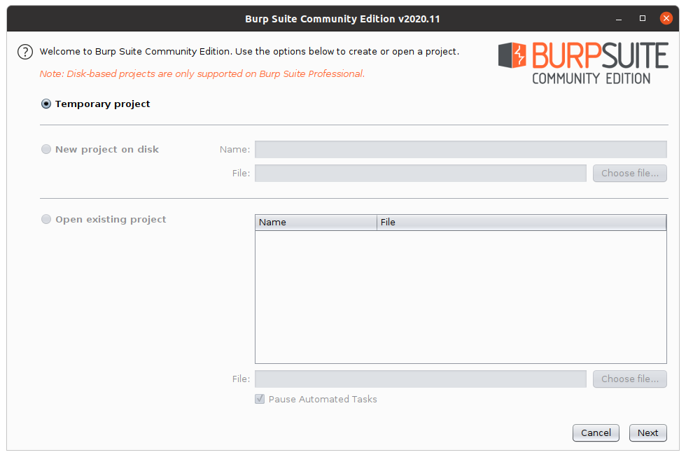

これは Burp Suite の各種機能の設定や、Burp Proxy 等のログを、一つのプロジェクトファイルに固めて保存できる機能を利用するための画面です。
もっとも、今回講義で利用する Community Edition ではこの機能が制限されており、永続化されたプロジェクトファイルを作成することができません。
この画面が表示されたら、画面右下の「Next」ボタンを押してください。

すると以下のような画面が表示されるはずです。


この画面からは、Burp Suite の各種ツールに、別途 Export しておいた設定を流し込むことができます。
本講義の範囲では、この機能は特に利用する必要がないので、一旦右下の「Start Burp」ボタンを押下して次の画面に進んでください。

すると、今度は、以下のような画面が表示されるはずです。

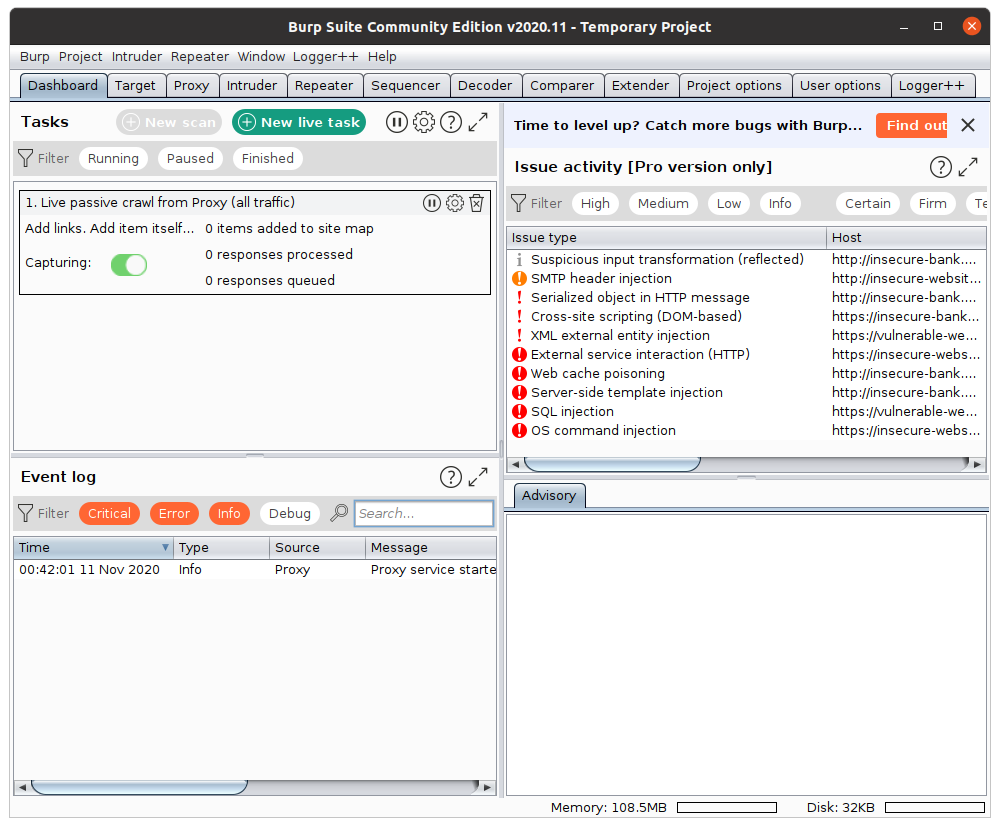

これが Burp Suite のメインウィンドウです。
無事 Burp Suite が起動できました。

## Burp Proxy ことはじめ

Burp Suite のメインウィンドウが起動できたら、画面上部の「Proxy」タブを選択してください。
すると以下のような画面が表示されるはずです。

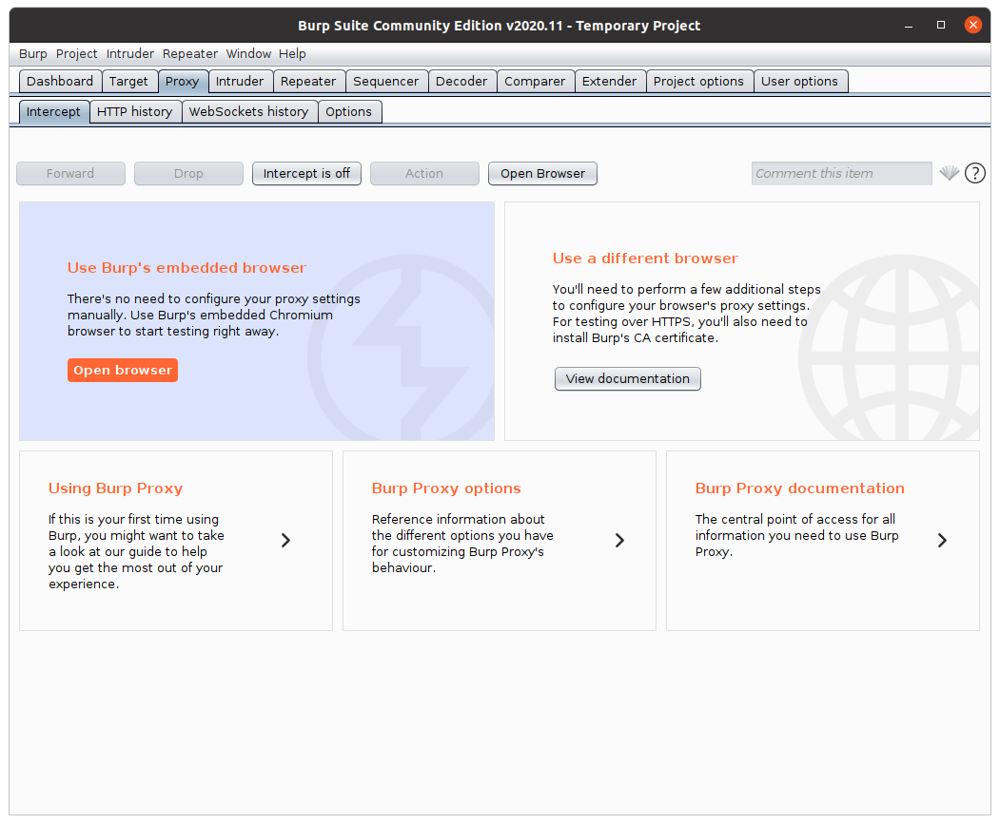

これは Burp Proxy という、Burp Suite の持つ HTTP プロキシ機能を利用するための画面です。
以下の概念図のように、Web ブラウザの HTTP 通信を Burp Proxy を経由して行うように設定することで、この画面から通信に関する様々な情報を確認したり、通信の内容を書き換えたりすることができるようになります。

```
[Web ブラウザ] <--> [Burp Proxy] <--> [Web サーバ]
```


「Proxy」タブ内にもいくつかのタブが提供されていますが、それらはそれぞれ、以下のような機能を有しています。

- 「Intercept」タブ … Burp Proxy によりインターセプト（後述）された通信を操作するためのタブ
- 「HTTP History」タブ … Burp Proxy を通過した HTTP 通信に関するログを閲覧するためのタブ
- 「WebSockets History」タブ … Burp Proxy を通過した WebSocket 通信に関するログを閲覧するためのタブ
- 「Options」タブ … Burp Proxy 全体の設定のためのタブ

この画面（Burp Proxy の画面）が確認できたら、説明の都合上、**一旦「Intercept」タブ内の「Intercept is on」ボタンを押下してください**。
すると、先の画面例のように、そのボタンのキャプションが「Intercept is off」という文字列に変化するはずです。

## ブラウザの設定をする

さて、Web ブラウザの HTTP 通信を Burp Proxy を経由するように設定してみましょう。
そのために、まずは手元の Google Chrome に、[SwitchyOmega](https://chrome.google.com/webstore/detail/proxy-switchyomega/padekgcemlokbadohgkifijomclgjgif) という拡張機能をインストールしてください。
この拡張機能 SwitchyOmega は、Google Chrome のプロキシ設定の容易な切り替えを可能にしてくれるものです。

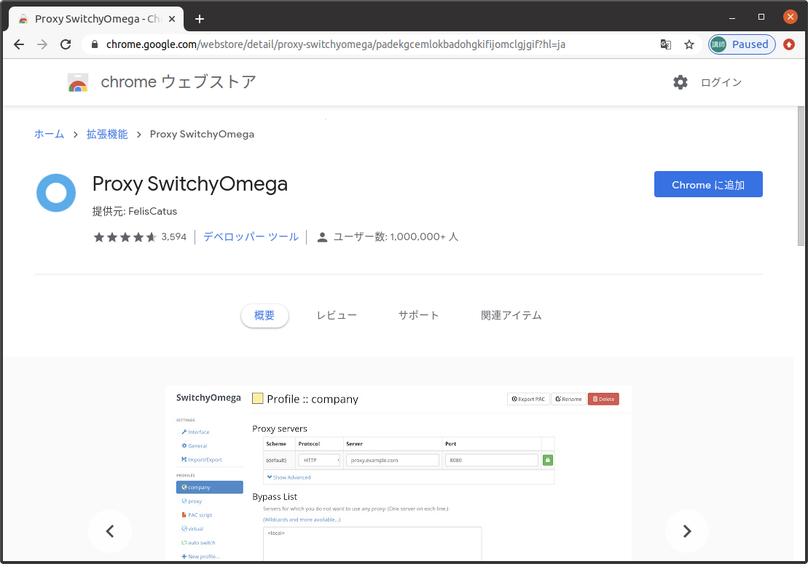

この拡張機能がインストールできると、以下のような画面が表示されるはずです。
もしインストール時に表示されなかったとしても、Google Chrome の拡張機能一覧から SwitchOmega の設定画面を開くことにより、同様の画面に到達することができます。

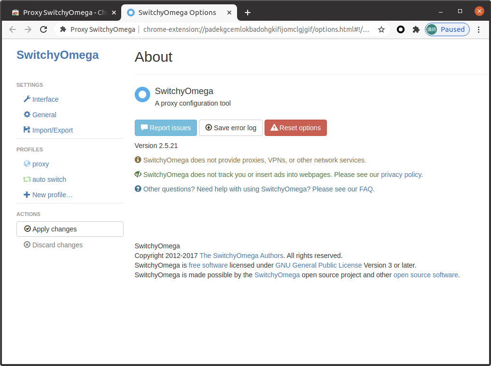

これは SwitchyOmega の設定画面です。
この画面に到達できたら、画面左側の「proxy」という項目をクリックしてください。
すると以下のような画面が表示されます。

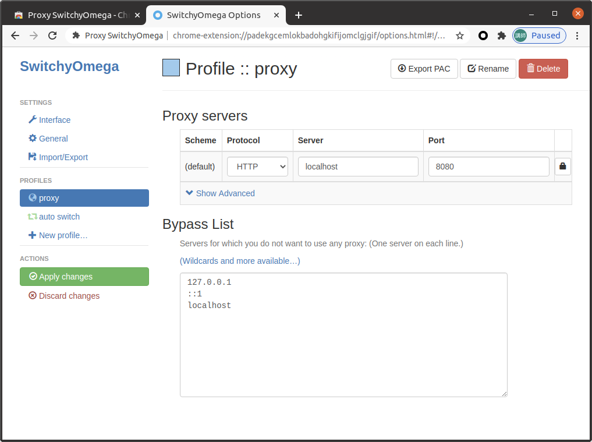

この画面からは、「proxy」というプロファイルに紐づくプロキシサーバを定義することができます。
この画面が表示できたら、画面右側の「Proxy servers」の項目の設定を、以下のように修正してください。

- Protocol: `HTTP`
- Server: `localhost` （＝先ほど起動した Burp Proxy が動作しているホスト）
- Port: `8080` （= 先ほど起動した Burp Proxy が動作しているポート番号）

この設定ができたら、画面右上に表示されている SwitchOmega のアイコンをクリックして、その後表示されるメニュー内の「proxy」という項目をクリックしてください。
以下に画面例を示します。

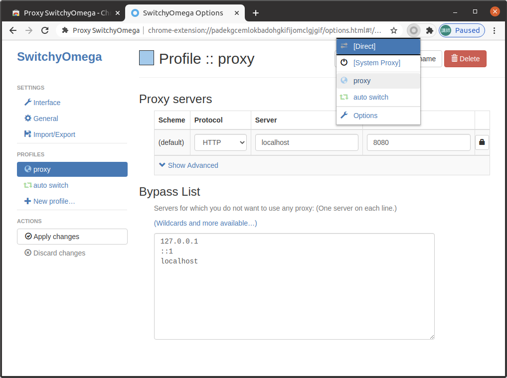

これにより、Google Chrome は、SwitchyOmega 上で定義したプロファイル「proxy」に紐づくプロキシサーバを用いて通信を行うようになります。

今回はひとつだけプロファイルを定義しましたが、複数のプロファイルを定義した後に、同様に画面右上の SwitchyOmega のアイコンからプロファイルを選択することで、複数のプロキシサーバを切り替えて使うことができます。

なお、**行った設定を元に戻したい（＝プロキシサーバを経由せずに直接通信を行うようにしたい）場合**には、画面右上の SwitchyOmega のアイコンをクリックした際に表示されるメニューの中から「[Direct]」という項目を選択してください。

## HTTP 通信のログを確認する

さて、ここまでの設定が上手く行えていれば、Google Chrome は Burp Proxy を経由して通信を行うようになっているはずです。

試しに `http://example.com` （`https:` ではないことに注意してください！）にアクセスしてみてください。
すると以下のような画面が表示されるはずです。

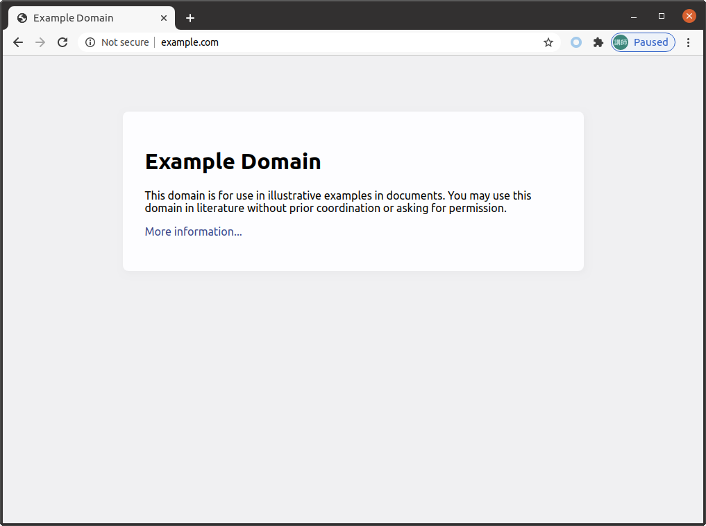

ブラウザ上で正しくこのような画面が表示されることが確認できたら、Burp Suite のウィンドウ内の「Proxy」タブ内のタブ「HTTP History」を確認してみてください。
するとここには `http://example.com` との間で行われた通信のログが、以下のような形で表示されているはずです。

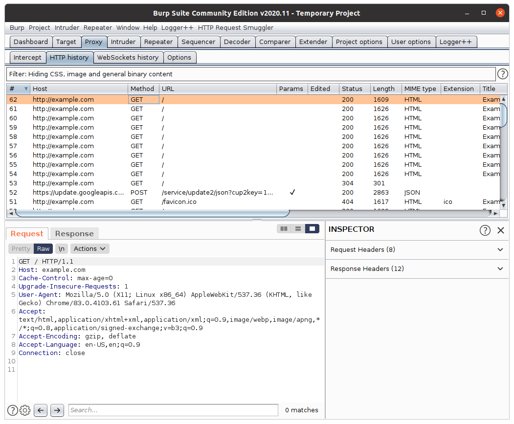

この画面の各要素は、それぞれ以下のような機能を持ちます。

- 画面下部左側の「Request」パネル … 画面上部で選択されている HTTP 通信のリクエストの詳細を表示する機能
- 画面下部左側の「Response」パネル …  画面上部で選択されている HTTP 通信のレスポンスの詳細を表示する機能
- 画面下部右側の「INSPECTOR」パネル … 画面上部で選択されている HTTP 通信の情報を構造化して表示してくれる機能

これで Google Chrome 上で行った通信の内容を Burp Proxy 上で確認できるようになりました。

## HTTPS 通信を閲覧するための設定をする

ここまでの手順により、`http://example.com` への通信のような HTTP 通信であれば、Burp Proxy から覗き見ることができるようになりました。

しかし `https://example.com` のような URL にアクセスすると、TLS 証明書に関するエラーが表示されるはずです。
これは Burp Proxy が通信を覗き見るために、自身が生成したダミーの証明書を Web ブラウザに対して返すものの、そのダミーの証明書は（当然のことですが）ルート証明書からの Trust Chain に含まれていないためです。

いま、HTTPS 通信を Burp Proxy 上で閲覧するためには、[この PortSwigger 社のマニュアル](https://portswigger.net/burp/documentation/desktop/getting-started/proxy-setup/certificate) に示されているような設定が必要になります。
本講義では以降、HTTPS を用いた通信も Burp Proxy 上で扱うことがありますから、同マニュアルを自分で確認して、適切な設定を施しておいてください。

設定が上手くいっているかを確認するためには、`https://example.com` のような URL に Google Chrome 上でアクセスしてみるとよいでしょう。
もしうまく設定ができていれば、以下の画面例のように、`https://example.com` に対する通信ログが記録されているはずです。

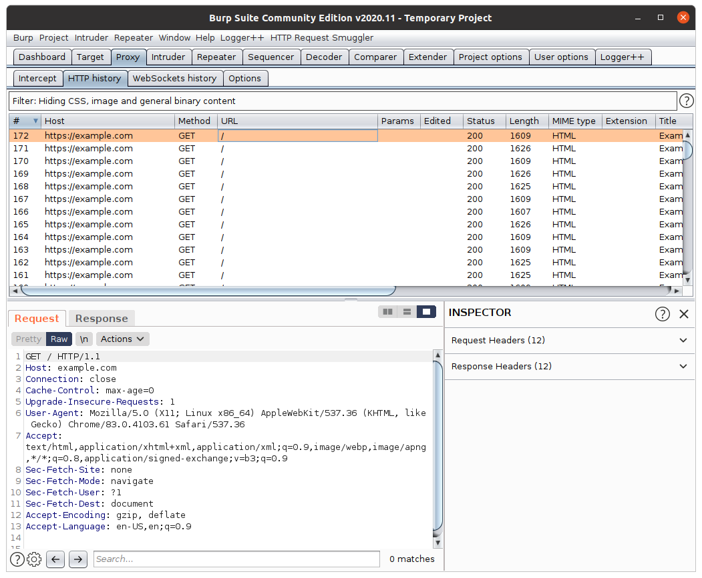

## 通信をインターセプトする

さて、ここまでは Burp Proxy の機能を用いて、Web ブラウザと Web サーバの間の通信の内容を閲覧する方法を確認しました。
この「通信を閲覧する」という機能は、Burp Proxy が持つ、非常に強力な機能です。

一方 Burp Proxy はこの他にも、もう一つの大きな機能として、**「通信を途中でせき止めて（＝インターセプトして）改変する機能」**を持っています。
今度はこの機能を試しに利用してみましょう。

まずは「Proxy」タブ内の「Intercept」タブ内にある、「Intercept is off」ボタンを押下してください。
するとボタンのキャプションが「Intercept is on」という文字列に変化するはずです。

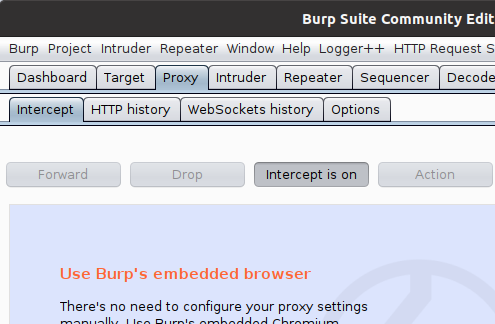

このような操作ののち、Google Chrome 上で `http://example.com` にアクセスしてみてください。
すると以下の概念図のように、一度 Burp Proxy で通信がせきとめられた状態になります。

```
Google Chrome --> Burp Proxy ... Web サーバ
```

せき止められている通信は Burp Proxy の画面から確認できます。
以下に画面例を示します。

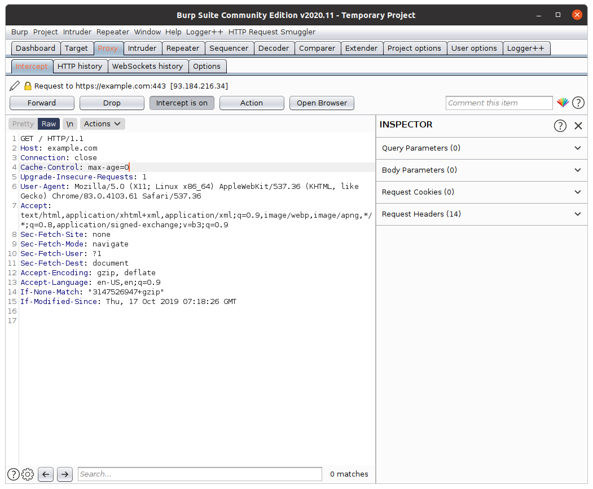

いまこの画面からは、今 Web サーバに送信されようとしている HTTP リクエストの中身を、自由に編集することができます。
中身の編集が終わったら、画面上部の「Forward」ボタンを押下することにより、せき止められている通信を Web サーバまで届けることができます。

```
Google Chrome --> Burp Proxy --> Web サーバ
```

このように、Burp Proxy の持つインターセプト機能を利用すると、ブラウザから Web サーバに届けられる通信の中身を改ざんすることができます。
これは Web アプリケーションの（ちょっとした）テストの際に有用です。

また「Proxy」タブ内の「Options」タブ上で適切な設定を施すことにより、その逆の、Web サーバからブラウザに届けられる通信の内容も改ざんすることができます。
本講義ではブラウザに届く通信を改ざんする必要のある場面があまり存在しないため、具体的な方法の説明は省略しますが、興味のある方は調べてみてください。

## まとめ

本章では以下を取り扱いました。

- Burp Suite の起動方法
- SwitchyOmega を利用して、Google Chrome の通信を Burp Proxy 経由にする方法
- Burp Proxy 上で HTTP 通信のログを確認する方法
- Burp Proxy 上で HTTPS 通信のログを確認するための方法
- Burp Proxy により Google Chrome からサーバへの通信をせき止め、編集を加えてから通信を継続させる（＝インターセプトする）方法

これらのうち、インターセプト以外の操作は Chrome DevTools などのブラウザ標準の機能によっても行うことができます。
興味のある方は調べてみてください。

また、Burp Proxy は Burp Suite 内の他の各種ツールを利用する際のハブとしても機能してくれる機能です。
例えば、次の章で説明する Burp Repeater の利用には、Burp Proxy で確保した通信ログが非常に役立ちます。

本章で取り扱った操作どれも基礎的なものですから、最低限、本講義に臨む前に覚えておいてください。