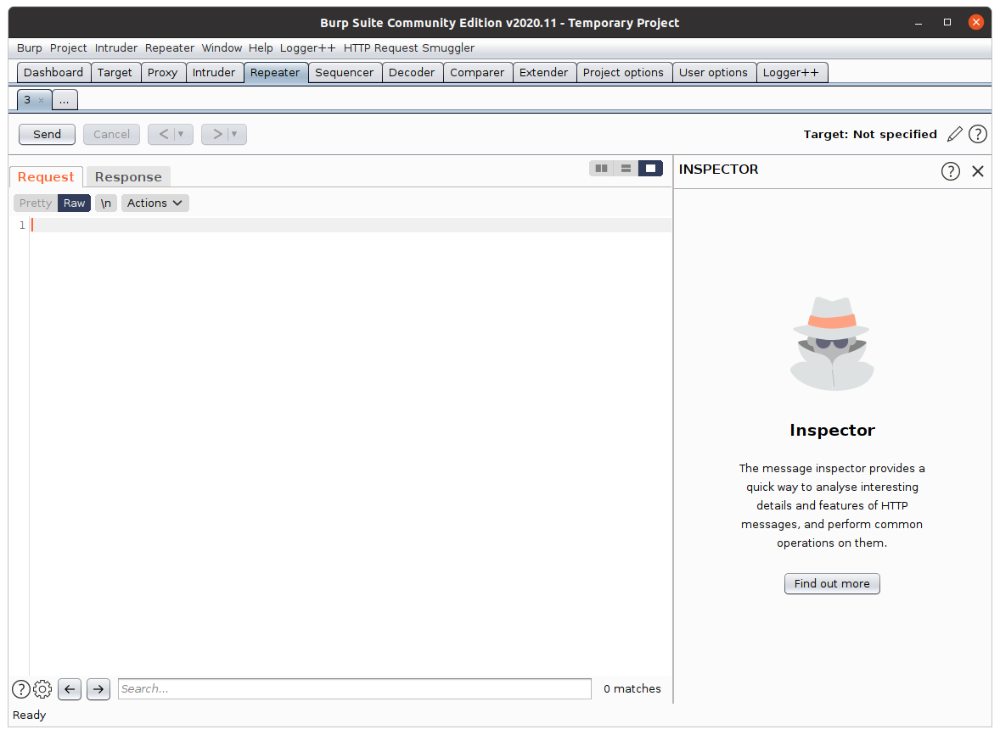
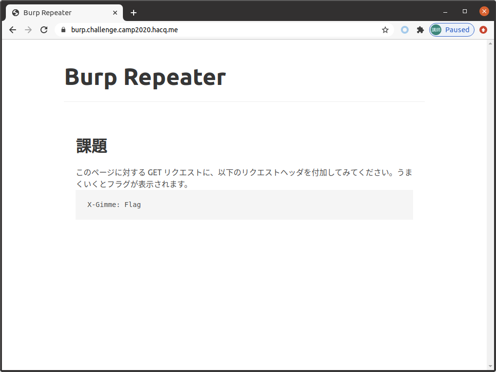
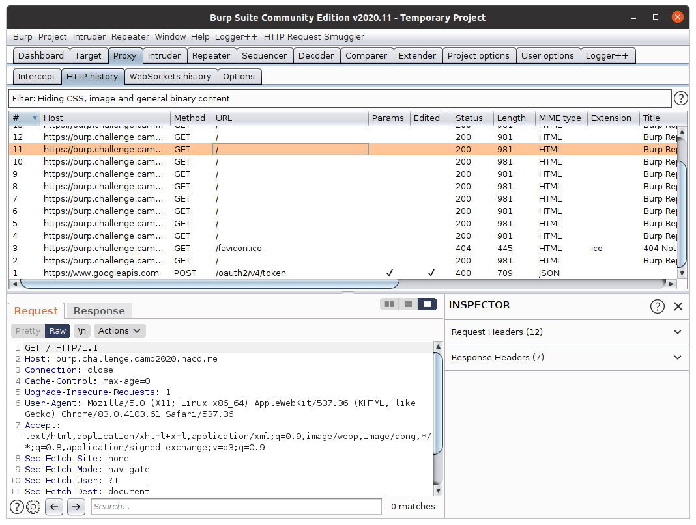
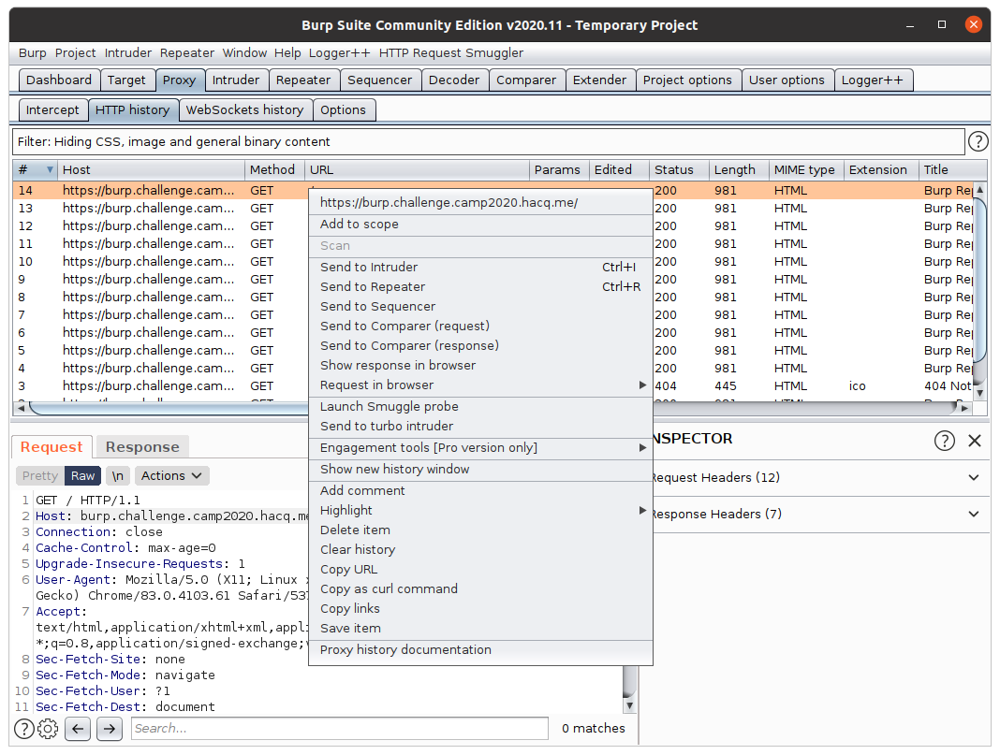
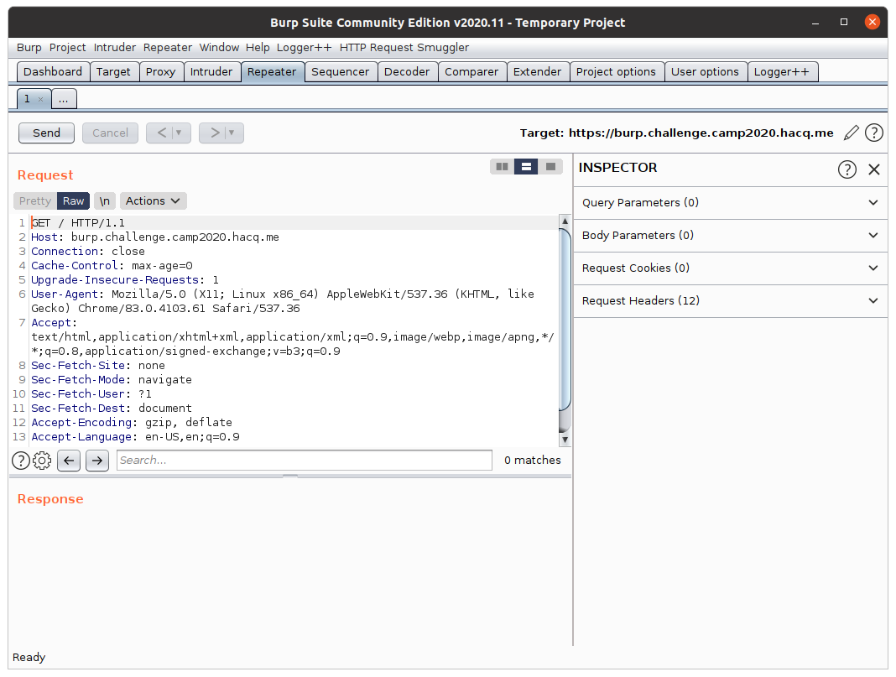
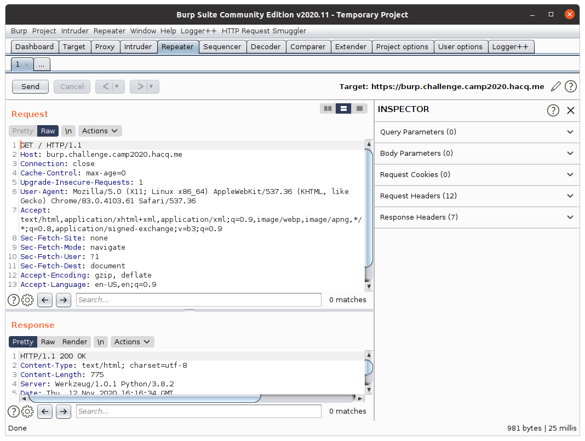
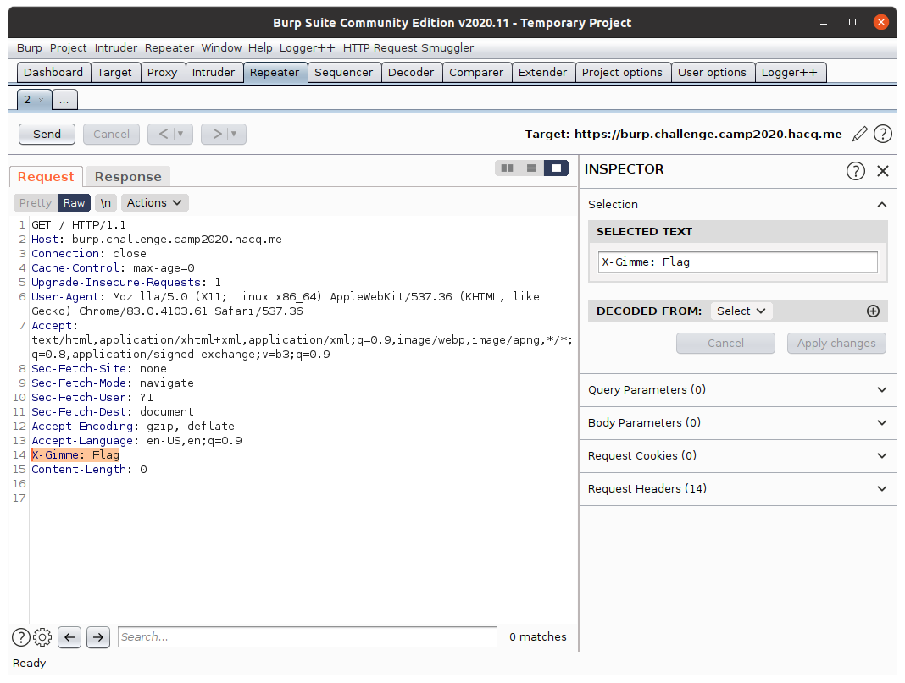
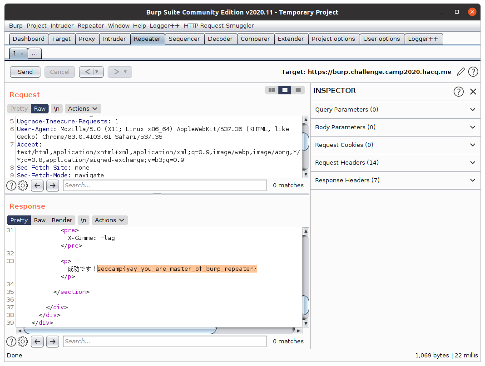

# Burp Proxy を利用する

本講義の中では、Web アプリケーションの解析・検証をするために、HTTP/HTTPS 通信の内容を精査したり、その中身を書き換えたりしていくことになります。
このような操作のためには Burp Suite が非常に便利ですから、まずは Burp Suite に含まれる各種ツールに慣れるところから始めましょう。

本章では、Burp Suite の中で最もベーシックな機能であると言っても過言ではない [Burp Proxy](https://portswigger.net/burp/documentation/desktop/tools/proxy) を利用して、HTTP/HTTPS 通信の中身を閲覧する方法を説明します。

## Burp Repeater とは

Burp Suite の「Repeater」タブから利用できる Burp Repeater は、主に Burp Proxy を通ったリクエストの編集・再送を行うためのツールです。

ここからは、実際に Burp Repeater の使い方を、実際に通信を行いながら確認していくことにします。

## Burp Proxy を通ったリクエストを再送する

まずは [この演習用 Web ページ](https://burp.challenge.camp2020.hacq.me/) に、[先の章](./03-burp-proxy.md) で取り扱ったような方法で、Burp Proxy を経由しながらアクセスしてみてください。
正常にアクセスできた場合、ブラウザには以下のような画面が表示されるはずです。

また、Burp Suite の「Proxy」タブから、以下の画面例のように、当該通信のログが確認できるはずです。

いま、「Proxy」タブに表示された通信のログレコードを右クリックすると、以下に示す画面例のようなコンテキストメニューが表示されます。

このメニューの中から、「Send to Repeater」という項目を選んでみてください。
その後「Repeater」タブを開くと、以下のような画面が表示されているはずです。
「Request」という項目に、先ほど「Proxy」タブで選択した HTTP 通信のリクエストが転記されているはずです。

最後に、同タブ内に表示されている「Send」ボタンを押下してください。
すると同タブ内の「Request」という項目に書かれたリクエストが Web サーバに送信されます。
また、レスポンスが得られた際には、以下の画面例のように「Response」という項目にその内容が表示されます。

かくして、Burp Proxy を通った HTTP リクエストを再送することができました。

## Burp Proxy を通ったリクエストを編集して送る

「Repeater」タブ内の「Request」という項目に表示されている内容を手で書き換えてから「Send」ボタンを押すと、自分の好きな HTTP リクエストを送信することができます。

いま、[この演習用 Web ページ](https://burp.challenge.camp2020.hacq.me/) は、`X-Gimme: Flag` というヘッダを持つ HTTP リクエストを受理したときのみ `seccamp{...}` 形式の特別な文字列を表示するようになっています。
そこで、ここでは練習として、この Web ページに `X-Gimme: Flag` というヘッダを付与したリクエストを送信してみましょう。

まずは先ほどと同様の手順で、演習用 Web ページへのリクエストを「Repeater」タブ内に転送して、以下の画面例のような状態を作ってください。

その後、リクエスト内に、`X-Gimme: Flag` という文字列を追加してください。

そして、最後に「Send」ボタンを押下してください。
すると以下のような形で、レスポンス中に `seccamp{...}` 形式の文字列が表示されるはずです。

## まとめ

本章では以下について取り扱いました。

- Burp Proxy 内の通信ログ（リクエスト）を Burp Repeater に転送する方法
- Burp Repeater からリクエストを再送する方法
- Burp Repeater 上で編集したリクエストを送信する方法

これであなたは、Burp Suite を用いることで、自由にコントロールした HTTP リクエストを（通信ログ中にあるリクエストを土台にしながら）発行できるようになっているはずです。
本講義の演習では、随所でリクエストを再送・編集するような操作を行いますから、ここで取り扱ったことはある程度覚えておくことを勧めます。