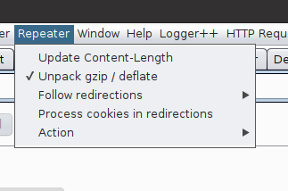
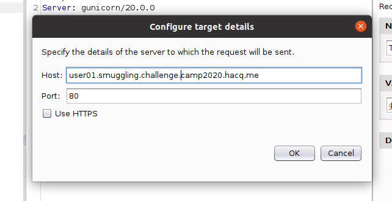
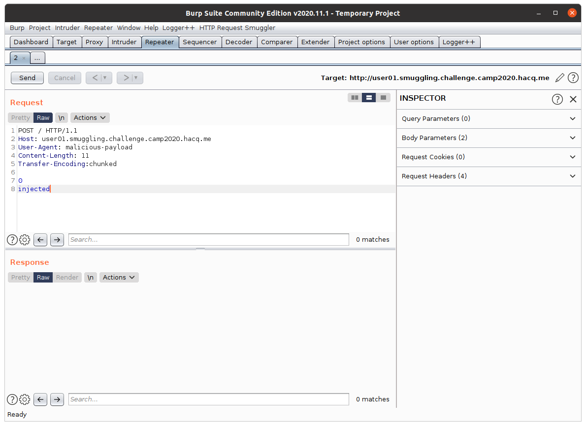
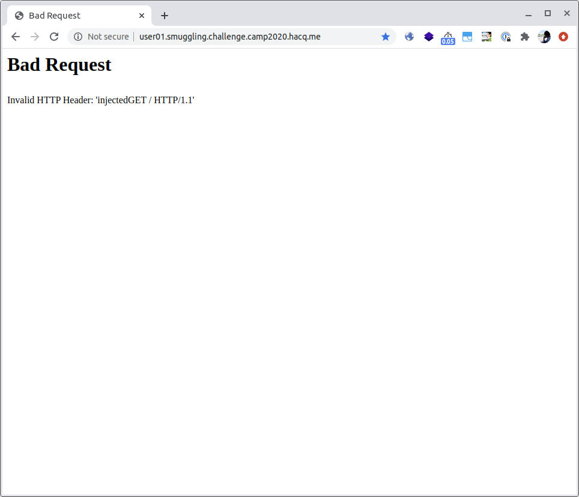

# HTTP Request Smuggling

この章では、HTTP/1.1 以前の TCP コネクションの再利用（Keep-Alive）に関する基礎知識と、**HTTP Request Smuggling** についてを取り扱います。

## 基礎知識

講義資料の Chapter 02 Section 01 （"HTTP Request Smuggling"）を参照してください。

## 演習（Optional）: Keep-Alive の挙動を確認する

時間があれば、適宜 Google 検索に頼りながら、実際に TCP コネクションが再利用される様子を確認してみてください。
詳しくは説明しませんが、およそ以下のような手順により確認できるはずです。

1. Wireshark をインストールする。
2. Wireshark 上で、端末から発生する通信のキャプチャを開始する。
3. 都合よくコネクションを再利用しながら喋ってくれる HTTP ページを探し（例: [この Web ページ](http://www.columbia.edu/~fdc/sample.html)）、Web ブラウザからアクセスする。
4. Wireshark 上での通信キャプチャを止める。
5. `http` などのフィルタにより、当該ページとの通信を探す。
6. 見つけた通信を右クリックし、そのメニュー内の（さらに）「Analyze」という項目の中にある「Follow TCP Stream」という項目を選択し、確かに同一 TCP コネクション内に複数の HTTP リクエスト・レスポンスの組が存在することを確認する。

## 演習: HTTP Request Smuggling（CL.TE）

### 概要

以下の環境は、GET リクエストを送ると `Hello! Method: GET` と出力し、POST リクエストを送ると `Hello! Method: POST` を出力し、さもなくばエラーを出力する Web アプリケーションです。

- http://default.smuggling.challenge.camp2020.hacq.me/

いま、このアプリケーションは、以下のような構成になっています。

```
Web ブラウザ <--> （古い）HAProxy <--> gunicorn
```

以降、便宜上、`[\x0b]` と書いたときには `\x0b` の一バイトを指すものとします。

この HAProxy は、`Transfer-Encoding:[\x0b]chunked` のようなヘッダをボディのサイズの解釈には利用しません。したがって、以下のようなリクエストを受け取った HAProxy は、これをバックエンドの gunicorn に全て転送します。

```
POST / HTTP/1.1
Host: default.smuggling.challenge.camp2020.hacq.me
User-Agent: malicious-payload
Content-Length: 11
Transfer-Encoding:[\x0b]chunked

0
injected
```

また、背後にいる gunicorn は、このリクエスト（正確には HAProxy により若干の変更が加えられたリクエスト）を受け取ると、その `Trasnfer-Encoding: chunked` ヘッダを優先します。
ここで **CL.TE** 型の Request Smuggling が起きるのです。

これを実際に、以下の手順で確かめてみましょう。

1. Burp Repeater の「Update Content-Length」をオフにする
2. Repeater から攻撃リクエストを送信する
3. ブラウザから、そのリクエストの後続となるリクエストを送信し、確かにリクエストが攻撃リクエストにより汚染されることを確かめる

### Burp Repeater の事前準備

まず Burp Suite を開いて、画面上部の「Repeater」メニューから「Update Content-Length」という項目を探し、その項目にチェックがついていない状態にしてください。以下のような状態になっていれば OK です。



### Burp Repeater 上で攻撃リクエストを作る

次に Burp Repeater から攻撃リクエストを送信する用意をしましょう。
はじめに、Burp Repeater を開き、「Request」の項目に以下のテキストをコピー & ペーストしてください。

```
POST / HTTP/1.1
Host: CHANGE_ME.smuggling.challenge.camp2020.hacq.me
User-Agent: malicious-payload
Content-Length: 11
Transfer-Encoding:%0bchunked

0
injected
```

その後、ペーストしたテキスト内の `CHANGE_ME` という値を、あなたに割り当てられた固有の ID（`user01` のような文字列; 講義中に伝えられます）に置き換えてください。
そして、`%0b` 3 文字をハイライトした上で右クリックし、表示されるコンテキストメニューの中から、「Convert Selection > URL > URL-decode」を選択してください。
すると （`\x0b` を URL エンコードした際の表記である）`%0b` という 3 文字が URL デコードされ、`\x0b` の 1 バイトへと変換されます。

また、Burp Repeater の画面の右上のペン型のボタンから、以下のようなダイアログを開いてください。



ダイアログが開けたら、各項目に以下のような値を入力してください。

- `Host`: `（あなたに割り当てられた固有の ID）.smuggling.challenge.camp2020.hacq.me`
    - 例: あなたに割り当てられた固有の ID が `user01` である場合、`user01.smuggling.challenge.camp2020.hacq.me`
    - 先ほど「Request」欄に入力したリクエストの `Host` ヘッダと同じ値になるはず
- `Port`: `80`

ここまで出来たら、「OK」ボタンを押して、ダイアログを閉じてください。
これで Burp Repeater の準備は終わりです。
最終的に画面は以下のようになっているはずです。



### 実際に試験してみる

Burp Repeater の準備が終わったら、Burp Repeater 上の「Send」ボタンを押して、リクエストを送信してみましょう。
するとレスポンスとして `Hello! Method: POST` のような値が返却されてくるはずです。

リクエストが送信できたら、あまり時間を空けずに、Web ブラウザから `http://（あなたに割り当てられた固有の ID）.smuggling.challenge.camp2020.hacq.me` にアクセスしてみてください。
すると以下の画面例のように、`injectedGET` なるメソッドでのアクセスが行われた、というエラーが発生した旨が画面に表示されます。



`injected` という文字列は、先ほど Burp Repeater から送信したリクエストのボディの末端の文字列です。
これにより、このような手順により、確かに後続のリクエスト（= Web ブラウザから送ったリクエスト）の先頭に、攻撃用リクエスト内の文字列を付加できたことが確かめられます。

## 演習: HTTP Request Smuggling（TE.CL）

TE.CL タイプの HTTP Reuqest Smugglng が起こるような構成を考え、そのような構成を実際に構築し、それに対する exploit コードを書いてみましょう。
