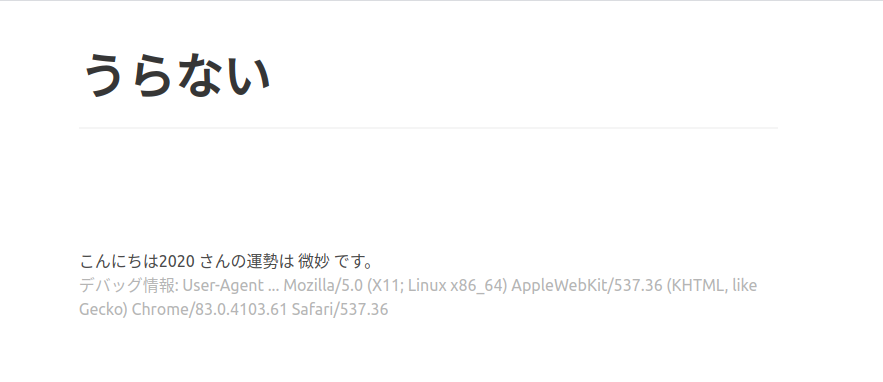
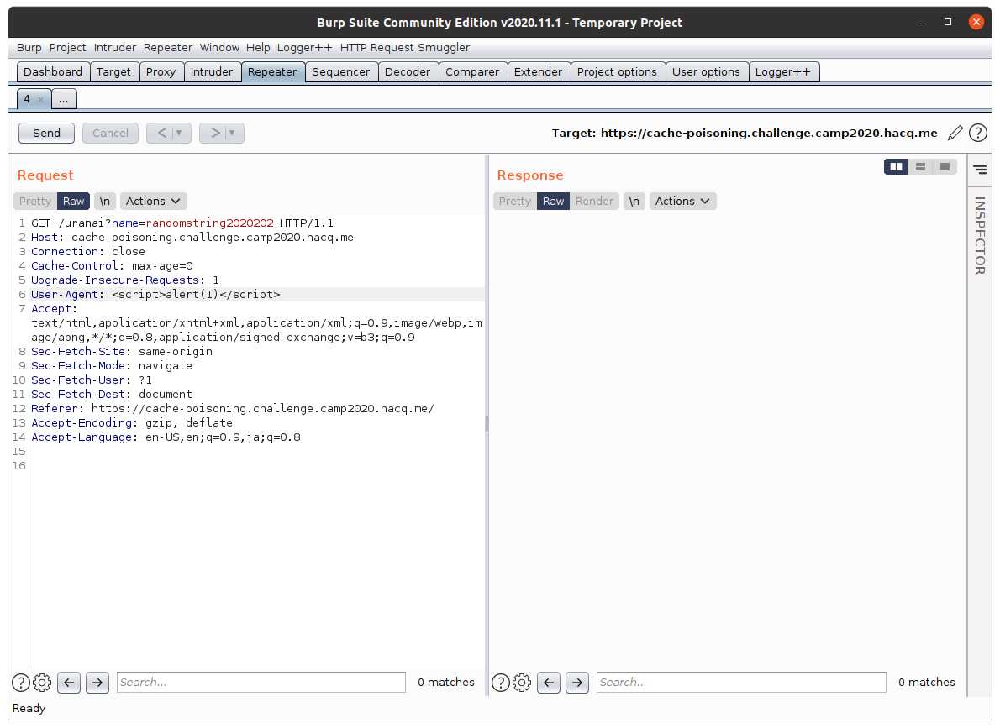
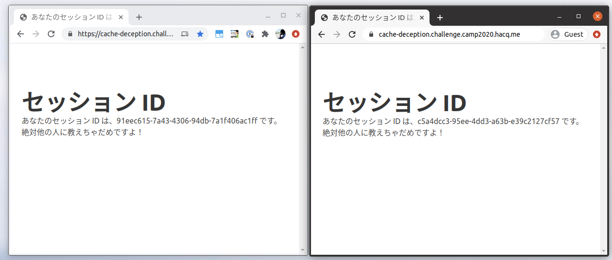

# キャッシュに関連した攻撃

この章では、Web におけるキャッシュの基礎的な動作、関連する問題についてを取り扱います。

## 基礎知識

講義資料の Chapter 02 Section 02 （"キャッシュに関連した攻撃"）を参照してください。

## 演習: Web Cache Poisoning

以下の Web アプリケーションは、名前を入力すると、その名前の人の運勢を占ってくれます。

- https://cache-poisoning.challenge.camp2020.hacq.me/

試しに「こんにちは2020」さんの運勢を占ってみたときの画面例を以下に示します。



また、この Web アプリケーションは 1 分間ほど、この占いの結果をキャッシュします。
運勢は数秒単位で変わるものでもないので、この挙動は妥当だと思って良さそうです。

返却されたレスポンスがキャッシュから取り出されたものかは、`X-Cache-Status` レスポンスヘッダを通して確認できます。
試しに [「こんにちは2020さん」の占い結果](https://cache-poisoning.challenge.camp2020.hacq.me/uranai?name=%E3%81%93%E3%82%93%E3%81%AB%E3%81%A1%E3%81%AF2020) のページを何度か開いてみると、少なくとも２度目以降は、以下のように `X-Cache-Status` ヘッダの値が `HIT`（キャッシュにヒットした = キャッシュからレスポンスが返却された）になっているはずです。

```
X-Cache-Status: HIT
```

ところで、占い結果のページには `User-Agent` ヘッダの値が出力されていますが、この出力処理は値のエスケープをしていません。つまり、`User-Agent` に悪意のある値を挿入することで、攻撃者はこの Web ページ中に任意の HTML タグを挿入することができます。

もっとも、このような挙動は、キャッシュ機構が働いていない限り特に問題のないものです。攻撃者が、HTML タグを挿入した Web ページを他者に見せることは、Web ブラウザの仕様上非常に難しいことだからです。

しかし、今回は占い結果のページがキャッシュされますから、攻撃者は HTML タグを挿入したページをキャッシュに残してやること、それを容易に他者に見せることが出来ます。
このような攻撃は **Web Cache Poisoning** 攻撃というのでした。

ここでは、以下のような手順により、実際に Web Cache Poisoning 攻撃ができてしまうことを確かめてみましょう。

1. `User-Agent` ヘッダに文字列 `<script>alert(1)</script>` を指定しながら、まだ占ったことのない名前の占い結果のページにアクセスする
2. Web ブラウザから、直前の手順で占った名前の占い結果のページにアクセスする

### 悪意のあるリソースをキャッシュさせる

まずは適当な名前の占い結果ページ（`https://cache-poisoning.challenge.camp2020.hacq.me/uranai?name=適当な文字列`）を取得するようなリクエストを、Burp Repeater 上に準備しましょう。
ここで、名前としては、まだ誰にも使われていないであろうような値を選択してください。
また、その際には、`User-Agent` ヘッダに、以下のような文字列を指定しておきましょう。

```
<script>alert(1)</script>
```

かくなる準備を施した Burp Repeater の画面例を以下に示します。



準備が出来たら、Repeater の画面左上の「Send」ボタンから、実際に攻撃リクエストを送信してください。

### キャッシュを閲覧してみる

Burp Repeater から攻撃リクエストが送信できたら、Web ブラウザから、実際に占い結果のページにアクセスしてみましょう。すると、以下のようなポップアップが表示されるはずです。


これにて、攻撃者が挿入した HTML タグが、キャッシュを通して他者に届けられることが確かめられました。

## 演習（Optional）: Web Cache Deception

以下の Web アプリケーションにアクセスすると、セッション ID なる値が表示されます。

- https://cache-deception.challenge.camp2020.hacq.me/

この値は、各ブラウザセッション間でユニークな値となっています。
試しにプライベートモードのブラウザを用意し、そこで同じページを開いてみると、別の値が表示されるはずです。



以降はこのセッション ID という値が、他者に教えてはいけない、非常に大切な値であると仮定します。
その上で、他者のこの値を盗み出す手段がないかを考えてみることにしましょう。

### ヒント

この Web アプリケーションは、キャッシュサーバとして nginx を利用しています。
キャッシュに関する設定の一部を以下に示します。

```
    location / {
        proxy_pass http://127.0.0.1:8000/;
        proxy_cache cache-zone;
        proxy_cache_key $host$uri$is_args$args;
        proxy_ignore_headers Set-Cookie Vary;
        proxy_cache_valid 200 201 300 301 302 1m;
        add_header X-Cache-Status $upstream_cache_status;
        proxy_cache_bypass $skip_cache;
        proxy_no_cache $skip_cache;

        if ($request_uri !~* "\.(js|css)$") {
            set $skip_cache 1;
        }
    }
```

この設定により、「本来キャッシュされるべきでないもの」がキャッシュされてしまうことがないか、を考えてみるとよいでしょう。

## 演習（Advanced）: CDN の利用

講義スライド中に出てきたサービス情報も参考にしながら、CDN サービスを一つ選び、それを実際に利用してみてください。

1. CDN サービスにより、オリジンサーバから発行したレスポンスが、よしなにキャッシュされるようにする。
2. `Cache-Control` ヘッダ以外にその CDN サービスの挙動を制御するための機能が存在するかを調査する。存在する場合は、以下も行う。
    1. その機能を `Cache-Control` ヘッダの設定と食い違わないように気をつけながら利用してみる。
    2. その機能を `Cache-Control` ヘッダの設定と（あえて）食い違うような方法で利用してみる。